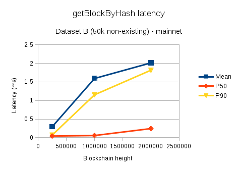
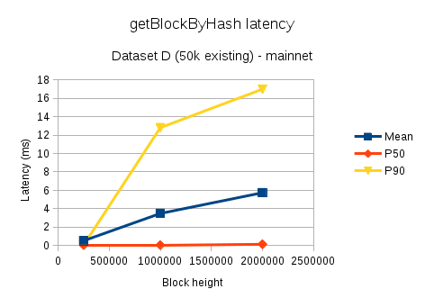
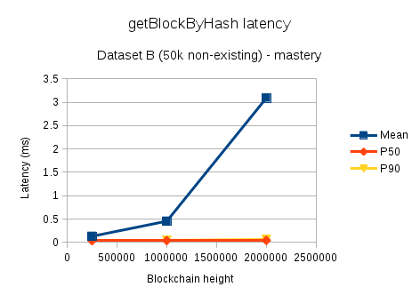
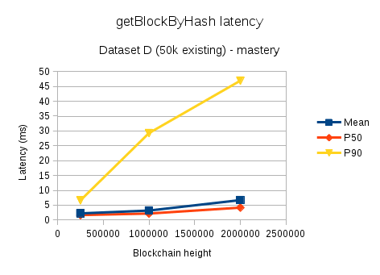
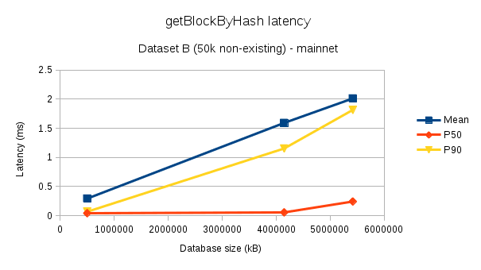
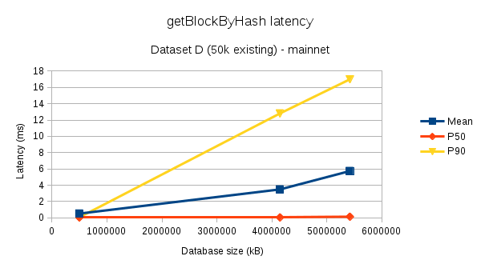

#### Increase in database size

The AIP requires modification to Aion's transaction structure by adding an optional field to hold a 32-byte address, which increases the database space requirements needed to store each transaction.  In this section, we will describe the internals of transaction persistence to show how the database requirements will change.  Transactions can be of arbitrary size.  We will consider the cases of the smallest transactions in order to look at the 'worst-case' transaction size increase that this AIP can cause.  

Transactions are stored in the database named _block_ using their RLP-encoded representation.  This database is keyed by block hash and the value is the RLP-encoding of the block, which contains the list of transactions.  The space required to store one transaction depends on the values of the fields of the transaction; some of which can be of arbitrary length.  The table below shows the transaction fields included in the RLP encoding and their possible sizes:

|Index| Field      | Size (bytes) |
|-----|------------|--------------|
|0    | nonce      | >= 1         |
|1    | to         | 0 or 32      |
|2    | value      | >= 1         |
|3    | data       | >= 1         |
|4    | timestamp  | >= 1         |
|5    | nrg        | >= 1         |
|6    | nrgPrice   | >= 1         |
|7    | type       | >= 1         |
|8    | signature  | 96           |

The size of the RLP representation will be at least the sum of the size of the fields -- 102 bytes.  Additional bytes are needed to form the correct RLP structure.  This is a transaction that can be considered valid by the kernel (not rejected due to nonce, balance, energy price/limit), but will certainly fail in real-life (because there is no acceptable timestamp that can be represented by 1 byte and there is no valid EVM or AVM data that can be encoded in 1 byte).

As a concrete example, below are the values and the sizes for a valid simple balance transfer (no data), which can be used as a reference point as a 'reasonable' small transaction:

| Field      | Value (all values in hex)                                        | Size (bytes) |
|------------|------------------------------------------------------------------|--------------|
| nonce      | 0                                                                | 1            |
| to         | a0c7f1c6fd7e45f98654547b09c102e8b5ce84d1d628591b479c25eca8d40a61 | 32           |
| value      | de0b6b3a7640000                                                  | 8            |
| data       | (empty)                                                          | 0            |
| timestamp  | 058cf216f7ff18                                                   | 7            |
| nrg        | e8480                                                            | 4            |
| nrgPrice   | 2540be400                                                        | 9            |
| type       | 1                                                                | 1            |
| signature  | 7b89324ec5673e22e7a157e6581 [... truncated for readability ...]  | 96           |

The total size needed to just store the data in these fields is 158.  The RLP-encoded representation of this particular transaction in the database is 166 bytes.

So far, we have described the persistence for strictly the transaction only.  In addition, transactions that are executed generate a transaction receipt and auxiliary information for managing the transaction.  These are stored inside the database named _transaction_, which maps transaction hashes to an RLP-encoding of the following structure, which we will call _transaction info_:

| Field           | Size (bytes) |
|-----------------|--------------|
| postTxState     | 32           |
| bloomFilter     | 256          |
| logs            | >= 0         |
| executionResult | 32           |
| nrgUsed         | >= 1         |
| error           | >= 0         |
| blockHash       | 32           |
| index           | >= 0         |

Transactions that get executed will cost at least an additional 352 bytes of persistence to store the transaction info, plus extra bytes for RLP-encoding.  

In order to augment the storage to accommodate storing a beacon block hash, only the transaction representation (inside _block_ database) needs to change.  Specifically, an additional element needs to be added to the encoded RLP list to represent the beacon hash.  It will be either the value `0` (if transaction didn't have beacon hash) or a 32-byte block hash (the transaction block hash).  Therefore, after the proposed change, transactions using this feature will be 32 bytes larger (not including any RLP characters needed to form a valid encoding).  Transactions not using this feature will be 1 byte larger.

Comparison of transaction sizes before and after this AIP, if we assume that the transaction info is at the smallest possible size:

|                                 | Tx size | Tx + TxInfo size | Tx size with beacon hash | Tx with beacon hash + TxInfo size |
|---------------------------------|---------|------------------|--------------------------|-----------------------------------|
| Smallest possible transaction   | 102 B   | 454 B            | 134 B (+31%)             | 486 B (+7%)                       |
| Simple balance transfer example | 158 B   | 510 B            | 190 B (+20%)             | 542 B (+6%)                       |

#### Increase in transaction processing latency

In order to perform the validation for a transaction containing a beacon hash, the kernel needs to check its database to answer the question of whether the given beacon hash is in the main chain.  Consequently, latency for transaction-processing operations will increase.  These operations are:

1. Updating the Pending State and Transaction Pool when a new transaction is received through RPC
1. Updating the Pending State and Transaction Pool when a new transaction is received via P2P
1. Verifying transactions within a block when a new block needs to be connected to the block chain (blocks received through RPC, P2P, or loading from database during start-up).

Since transaction processing is critical to kernel functionality and database checks can incur a relatively expensive I/O seek, there are two concerns that warrant further investigation:

1. How much is the latency increase and how does it scale?
1. Can the latency increase be abused to launch attacks against the network or individual nodes?

To understand the latency increase and its scale, a benchmark was performed to measure the latency for checking the existence of a block hash in the database.  It involved calling the RPC method `eth_getBlockByHash` across different selections of database block heights, for block hashes ranges, and database content.  These latencies are then compared against benchmarks that measure the latencies for receiving a single transaction through RPC and receiving a transaction through P2P.  The latency for transaction verification when connecting blocks to the block chain was not considered because in those cases, transactions are processed concurrently, making instrumentation difficult.  However, the transaction verification for blocks should have comparable latency to the when receiving single transactions as their implementation follows almost the same code path.

##### Block hash lookup latency analysis

The RPC method `eth_getBlockByHash` was tested under various parameters in order to understand how latency of the operation scales:

1. Dataset: five different data sets were used that highlight that effects of caching and locality.  All have 50000 block hashes.
   1. Dataset A: block hashes that aren't in the database; 20% unique values
   1. Dataset B: block hashes that aren't in the database; 100% unique values
   1. Dataset C: block hashes that are present in database; 20% unique values
   1. Dataset D: block hashes that are present in database; 100% unique values
   1. Dataset E: block hashes are sequentially increasing by 1; 100% unique values
1. Blockchain height: to illustrate how the look-up latency scales with blockchain height.  Heights of 250k, 1M, and 2M were tested.
1. Database: The databases tested are pruned versions of Mainnet and Mastery.  Two different networks were tested to make sure the results weren't specific to characteristics of just one database.

Every permutation of the possible values for each parameter was tested once.  Observations from the benchmarking have a lot of noise in the measurements; most likely, this is due to the latencies being influenced heavily by caching behaviour (of Leveldb and hard disk) and what other background tasks the OS may be running at the time.  For analysis, the main statistics considered are the mean, and 50th, and 90th percentiles (p50 and p90) of latency, measured as wall-clock time in the kernel.  The minimum, maximum, and 99th percentile were also considered, but those were too prone to large outliers caused by unpredictable OS behaviour.

The most predictable and least interesting case is Dataset E.  It is not a very realistic use-case, but it provides a lower bound for the benchmarks.  The mean, p50, and p99 for both Mainnet and Mastery networks across all block heights were within the range of 0.38 ms to 0.76 ms.  When looking at the latencies chronologically, there is an initial slow query at the start, then the rest of the queries are very fast.  This can be explained by the fact that the hashes in this data set have very high locality in the database, so there is a small number of expensive disk seeks, but the following queries are very fast because that part of the disk has been cached.

Dataset A and C further illustrate the "warming up of cache" phenomenon.  For both datasets, the initial 5000 queries are unique and the remaining queries are for block hashes that were already present in the initial 5000.  There is a clear change at N=5000, where the number of queries that take > 25 ms drastically drops.  This can be seen in the figure below, which shows the case of the mainnet network with 2M blocks, but the behaviour is the same regardless of blockchain height and database.

")

Dataset B and D bear the most resemblance to the expected real-life query patterns.  B contains 50,000 queries for addresses not present in the database (uniformly distributed over the valid range of hash values).  D contains 50,000 queries for addresses present in the database (a random sample taken for each database used in the experiments).  The graphs below show the mean, p50, and p90 latencies for the two data sets for both networks at various block heights.

Two main observations from this data:

1. Most of the data points agree that as a blockchain's height grows, this query's latency also grows.  The growth is roughly linear.
1. Querying a non-existant hash takes less time than an existant hash

The one metric disagreeing with point 1 is in the mean for Dataset B on Mastery at 2M block height.  The most likely explanation for this is that there were a small number of outlying data points with extremely high latency; since the mean value is far higher than the p90, there are a small number of data points far larger than the others.

Two blockchains of the same height may contain different contents and thus, be of different physical size.  The sizes of the databases at each block height:

|         | 250k blocks | 1M blocks | 2M blocks |
|---------|-------------|-----------|-----------|
| Mainnet | 0.5 GB      | 4.0 GB    | 5.2 GB    |
| Mastery | 0.4 GB      | 1.9 GB    | 5.9 GB    |

The above graphs show the observed relation between block height and latency.  Similar plots were created that compared physical size to latency.  On Mastery, both relations had the same shape and pattern.  For Mainnet, the performance looked slightly worse, but still roughly linear.

We will use this data to compare against how long current transaction processing takes.  We are mainly interested in the worst case, so we will focus on Dataset D at 2M block height from both networks for comparison.  The data in tabular form:

|         | Mean    | P50     | P99      |
|---------|---------|---------|----------|
| Mainnet | 5.74 ms | 0.14 ms | 17.00 ms |
| Mastery | 6.70 ms | 4.20 ms | 11.54 ms |

##### Current transaction processing latency analysis

Current transaction processing was measured in two ways:

1. Wall-clock timing around the P2P transaction receiver while syncing Mainnet
1. Wall-clock timing around RPC method `eth_sendTransaction` while running Aion test suite

During the Mainnet sync, the Aion kernel was close to the head of the blockchain.  For testing the RPC method, the database was empty.  All tests were conducted on the same machine as the `getBlockByHash` latency tests from the previous section.  Note that these transactions can contain contract deployments/calls, which can be potentially have a very long run-time during VM execution.

The two cases follow a similar code path, but both were analyzed in order to have a variety of data sources and because they both reflect real-life use cases.  The aggregated observations of the latencies:

|                                | # observations | Mean     | P50     | P90      |
|--------------------------------|----------------|----------|---------|----------|
| P2P Transaction receiver       | 7138           | 2.41 ms  | 1.19 ms | 1.81 ms  |
| eth_sendTransaction RPC method | 311            | 10.33 ms | 2.84 ms | 27.22 ms |

From this table and the table of Mean/P50/P90 latency of `eth_getBlockByHash` Dataset D, we can see both operations experience a large variance in latency.  Adding block hash lookup could account for as little as 0.5% for very slow transactions or as much as 93% for very fast transactions.  The observations show that latency increase is a concern, but not definitely prohibively expensive.  It should be measured carefully during prototyping and implementation to get clearer data on the latency increase.  

